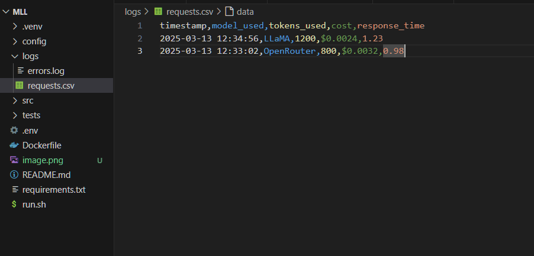

# MultiLLM Cost-Optimized API

## **📌 Features**
- Routes requests to multiple **LLM providers** (e.g., openrouter, LLaMA, HuggingFace).
- **Tracks token usage and cost** for every API request.
- Implements **automatic failover** to use the cheapest and most available provider.
- Provides a **standardized API endpoint** for text generation.
- Logs request data into a **CSV file** for cost tracking.
- Supports **GitHub Actions for CI/CD**.

---

## **Set-up instructions**
### **1 Install Dependencies**
Ensure you have **Python 3.9+** installed, then run:
```sh
pip install -r requirements.txt
```

### **2 Set API Keys**
Before running the application, create a **`.env` file** and add your API keys:
```sh
nano .env  # Or use Notepad on Windows
```
Inside `.env`, enter:
```


LLAMA_API_KEY=your_llama_api_key
OPENROUTER_API_KEY=your_openrouter_api_key
HUGGINGFACE_API_KEY=your_huggingface_api_key
```
Save the file after editing.

### **3 Run the Service (Locally)**
#### **Option 1: Run via Python**
```sh
python -m src.app
```

#### **Option 2: Run via PowerShell (Windows)**
```powershell
Set-ExecutionPo2licy Unrestricted -Scope Process
.\run.sh
```

## 📡 Example

- **Body (raw JSON):**
  ```json
  {
      "prompt": "What is AI?"
  }

### Expected Response:
```json
{
    "modelUsed": "LLaMA",
    "cost": 0.002,
    "tokens": 1200,
    "response": "AI stands for Artificial Intelligence..."
}

## Checking Logs:
All API requests are logged in `logs/requests.csv`.
To view logs:
```sh
cat logs/requests.csv
```
Or open it in Notepad (Windows):
```powershell
notepad logs/requests.csv
```

