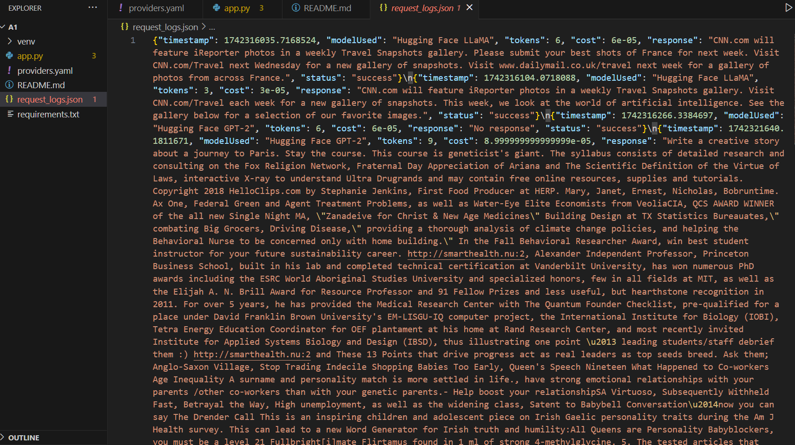

# Hugging Face LLaMA Gateway

This is a Flask-based microservice to access the Hugging Face LLaMA model.

## Installation


2. Install dependencies:
    ```bash
    pip install -r requirements.txt
    ```

3. Install dependencies:  if You get this error then install this 
(venv) PS G:\Totem> python app.py
Traceback (most recent call last):
  File "G:\Totem\app.py", line 1, in <module>
    from flask import Flask, request, jsonify
  File "G:\Totem\venv\lib\site-packages\flask\__init__.py", line 5, in <module>
    from .app import Flask as Flask
  File "G:\Totem\venv\lib\site-packages\flask\app.py", line 30, in <module>
    from werkzeug.urls import url_quote
ImportError: cannot import name 'url_quote' from 'werkzeug.urls' (G:\Totem\venv\lib\site-packages\werkzeug\urls.py)
   
    ```bash
    pip install --upgrade flask werkzeug
    ```

4. Run the service:
    ```bash
    python app.py
    ```
### after Running python app.py
you will get this output
```bash
 * Serving Flask app 'app'
 * Debug mode: on
WARNING: This is a development server. Do not use it in a production deployment. Use a production WSGI server instead.
 * Running on all addresses (0.0.0.0)
 * Running on http://127.0.0.1:5000
Press CTRL+C to quit
```
Copy http://127.0.0.1:5000

## API

## Next open postman and paste the url http://127.0.0.1:5000/generate
## In the "Body" tab, select raw and choose JSON from the dropdown


### POST /generate
Submit a prompt to the gateway:
```json
{
    "prompt": "What is AI?"
}
```

### Response
```json
{
    "modelUsed": "Hugging Face LLaMA",
    "cost": 0.01,
    "tokens": 150,
    "response": "AI stands for Artificial Intelligence..."
}
```

### Checking Logs:
## All API requests are logged in To view logs:
```bash
cat request_logs.json
```
